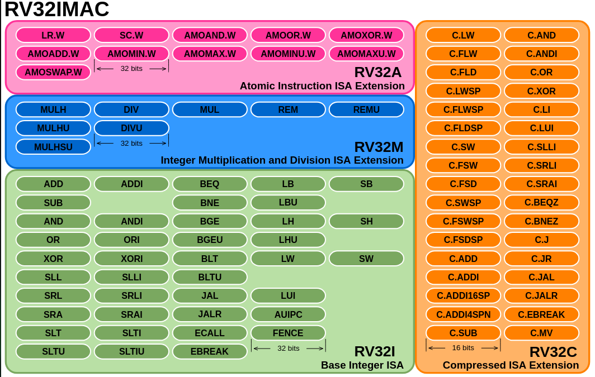

# Chapter 2: Exploring the RISC-V ISA

## 2.1 RISC-V: A Modular ISA

- **Fifth-generation design**  
  - RISC-V is the result of a research project that began in 1980.  
  - It incorporates lessons learned from previous ISA generations.

- **Designed for flexibility and longevity**  
  - Aims to succeed where previous architectures have failed.  
  - Avoids legacy complexity by learning from past ISA shortcomings.

- **Modular Instruction Set Architecture (ISA)**  
  - Unlike traditional ISAs (e.g., ARM Cortex), which evolve incrementally, RISC-V is modular by design.

- **Core structure**  
  - Consists of a mandatory base ISA (e.g., RV32I, RV64I, or RV128I).  
  - Augmented by a set of optional ISA extensions.

- **ISA extensions**  
  - Extensions include features like:  
    - **M:** Integer multiplication/division  
    - **F/D:** Floating-point support  
    - **A:** Atomic operations  
    - **C:** Compressed instructions  
    - **V:** Vector operations  
  - Extensions can be mixed and matched based on application requirements.

- **Custom CPU tailoring**  
  - Implementers can choose only the necessary features.  
  - Enables efficient designs for everything from microcontrollers to high-performance CPUs.

- **Resulting benefits**  
  - Reduces unnecessary complexity and overhead.  
  - Encourages innovation and adaptability across diverse computing environments.
 
---
 
## 2.2 RISC-V ISA Naming Convention

- **General Format:**  
  - RV + `<bit-width>` + `<ISA extensions>`  
  - Example: **RV32IMAC**

- **Breakdown of RV32IMAC:**  
  - **RV32I** – 32-bit Base Integer ISA  
    - Indicates a 32-bit CPU.  
    - The **I** extension stands for Integer instructions.  
    - This is the mandatory base ISA and includes fundamental instructions for:  
      - Arithmetic and logic operations  
      - Control flow (jumps, branches)  
      - Memory access (loads and stores)  
  - **M** – Integer Multiplication and Division Extension  
    - Adds support for MUL, DIV, REM, and related operations.  
    - Crucial for arithmetic-heavy workloads like DSP, cryptography, or scientific computing.  
  - **A** – Atomic Instructions Extension  
    - Enables atomic read-modify-write operations.  
    - Used for synchronization primitives (locks, semaphores) in multi-core or multi-threaded environments.  
  - **C** – Compressed Instructions Extension  
    - Adds 16-bit instruction encodings for frequently used operations.  
    - Reduces program size and improves instruction cache utilization.  
    - Useful in memory-constrained systems like embedded devices.

- **Why It Matters:**  
  - This naming convention makes it easy to identify a CPU's capabilities at a glance.  
  - Example: A processor labeled **RV64GC** is a 64-bit CPU with:  
    - Base Integer (I),  
    - General-purpose extensions (M, A, F, D),  
    - Compressed (C) instructions.

---

## 2.3 RISC-V ISA: Two-Part Structure

1. **Volume I – Unprivileged Specification**  
   - Defines user-level instructions (e.g., ADD, LW, MUL).  
   - Includes base ISAs (RV32I, RV64I) and standard extensions (M, A, F, etc.).  
   - Used by applications, compilers, and toolchains.  
   - Portable across hardware that supports the same unprivileged ISA.

2. **Volume II – Privileged Specification**  
   - Defines system-level behavior (OS and hypervisor support).  
   - Includes privilege modes (U, S, M), CSRs, traps, memory protection, etc.  
   - Used by OS developers and hardware designers.

---

## 2.4 RISC-V Privilege Levels

RISC-V defines three core privilege levels, similar to CPU protection rings:

| Privilege Level        | Alias   | Typical Use                        | Comparable to    |
|-----------------------|---------|----------------------------------|------------------|
| Machine Mode (M-mode)  | Ring 0  | Bootloaders, firmware, secure monitor | Supervisor/Root  |
| Supervisor Mode (S-mode)| Ring 1  | OS kernel, device drivers         | Kernel           |
| User Mode (U-mode)     | Ring 2  | Applications, user processes       | User space       |

- **Additional Modes:**  
  - **Hypervisor Mode (H-mode)** *(optional)*  
    - Enables virtualization features.  
    - Built as an extension to S-mode.

- **Control and Status Registers (CSRs):**  
  - Special registers that control or report system behavior.  
  - **Privilege-based access:**  
    - Higher modes (e.g., M-mode) can access CSRs from lower modes (e.g., S or U).  
    - Lower modes cannot access higher-level CSRs.

---
## 2.5 Overview of the Unprivileged RISC-V Specification

The unprivileged specification in RISC-V defines features that operate independently of Machine Mode (M-Mode) and Supervisor Mode (S-Mode). It includes the base Integer (I) ISA and various extensions such as floating-point (F), double-precision (D), and compressed instructions (C).

### Key Base ISAs:

- **RV32I**: Standard 32-bit integer instruction set  
- **RV32E**: A streamlined version of RV32I for embedded systems  
- **RV64I**: Extends RV32I to 64-bit registers and address space  
- **RV128I**: A 128-bit version for future expansion  

These ISAs either reduce or build upon RV32I. For example, RV64I adapts LOAD and STORE instructions to handle 64-bit data and memory addressing.

---

## 2.5.1 Overview of the RV32I Base Integer ISA

The RV32I base integer instruction set architecture (ISA) is the foundation of the RISC-V ISA, consisting of just **40 essential instructions**. It supports core operations necessary for working with 32-bit integers and includes:

- **Arithmetic**: Addition and subtraction  
- **Logical**: Bitwise operations  
- **Memory access**: Load and store  
- **Control flow**: Jumps and branches  

All instructions are **32 bits wide**, and the ISA defines **32 general-purpose registers**, each **32 bits** wide. In addition to these registers, the CPU also includes a **program counter (PC)**. A special register, **x0**, is hardwired to always read as zero, a common feature in many RISC architectures.

While registers are technically general-purpose, their usage is guided by the **Application Binary Interface (ABI)**. The ABI assigns specific roles to each register based on calling conventions, such as storing arguments, return addresses, temporary variables, or stack/frame pointers.

The RV32I ISA forms the **backbone of RISC-V systems**, ensuring minimal yet powerful functionality for efficient computing.

---

### RISC-V Symbolic Register Names (RV32I ABI Names)

In RISC-V, hardware registers are named **x0 to x31**, but they are also given **symbolic (ABI) names** to indicate their conventional use in high-level programming. These symbolic names improve code **readability** and follow a standardized **calling convention**.

| Register | ABI Name | Description                             |
|----------|----------|-----------------------------------------|
| x0       | zero     | Constant 0 (always reads 0)             |
| x1       | ra       | Return address                          |
| x2       | sp       | Stack pointer                           |
| x3       | gp       | Global pointer                          |
| x4       | tp       | Thread pointer                          |
| x5–x7    | t0–t2     | Temporary registers                      |
| x8       | s0/fp    | Saved register / Frame pointer          |
| x9       | s1       | Saved register                          |
| x10–x11  | a0–a1     | Function arguments / return values      |
| x12–x17  | a2–a7     | Function arguments                      |
| x18–x27  | s2–s11    | Saved registers                         |
| x28–x31  | t3–t6     | Temporary registers                     |

**Notes:**

- **zero (x0)**: Always reads 0; writing to it has no effect.  
- **ra (x1)**: Stores the return address when a function is called.  
- **sp (x2)**: Points to the top of the current stack.  
- **gp (x3)** and **tp (x4)**: Used for global and thread-local storage.  
- **t0–t6**: Temporary registers, not preserved across function calls.  
- **s0–s11**: Saved registers, must be preserved by the callee.  
- **a0–a7**: Argument registers for function calls; `a0` and `a1` also hold return values.

---

